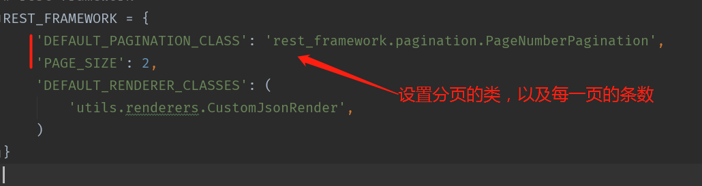
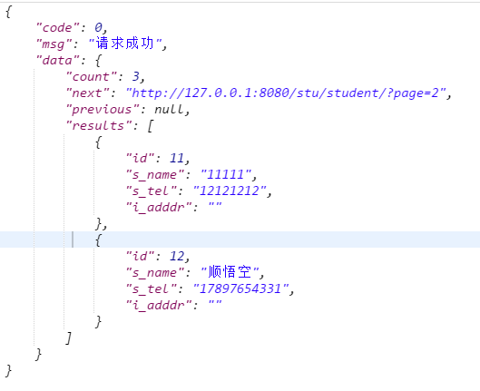
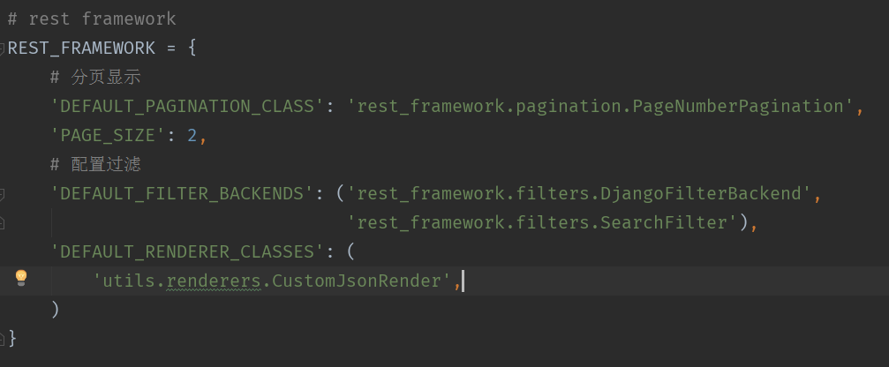
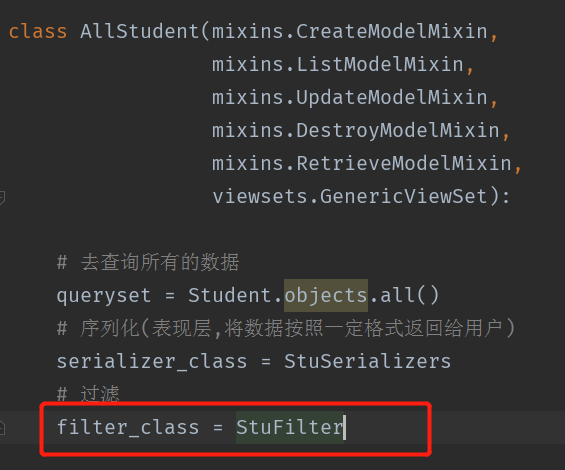
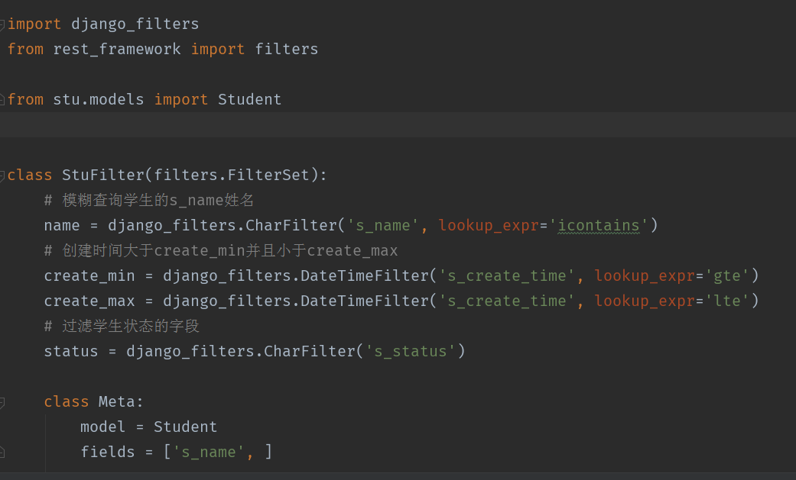
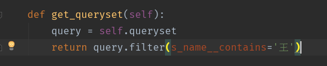
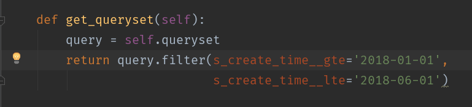
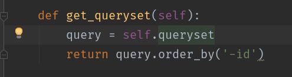
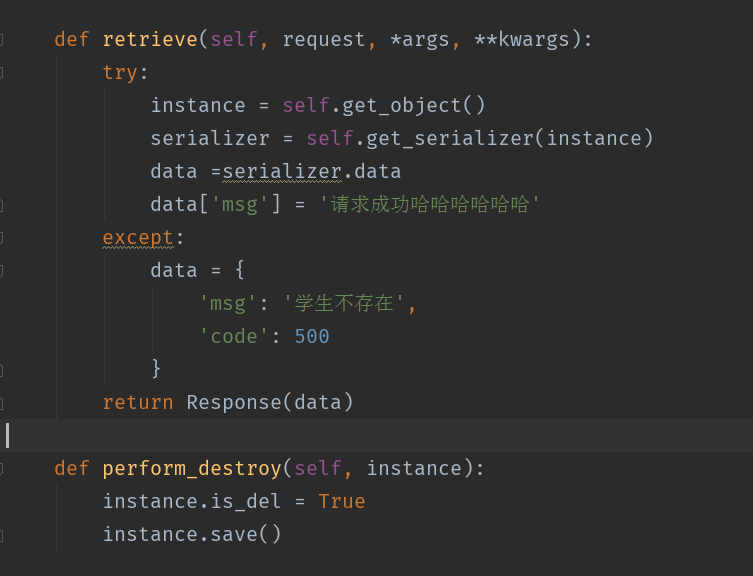

# rest使用(续)


### 1. 分页

修改settings.py配置文件，增加分页的配置信息



结果：



注意：在结果在data对应的value值中，有一个count的key，表示返回数据有3条，next表示下一个的url，previous表示上一页的url。


### 2. 过滤

修改settings.py配置文件，增加filter过滤的信息

#### 2.1 安装过滤的库

```
pip install django-filter
```

#### 2.2 配置settings.py的信息

配置DEFAULT_FILTER_BACKENDS




#### 2.3 views中指定filter_class



#### 2.4 编写filter_class过滤信息





#### 2.5 实现方法

##### 2.5.1 查询学生的姓名中包含王的学生

使用filter_class进行过滤筛选：

	http://127.0.0.1:8080/stu/student/?name=王

不使用filter_class进行筛选：




##### 2.5.2 查询学生的创建时间在2018年11月1号到2018年11月2号的学生信息

使用filter_class进行过滤筛选：

	http://127.0.0.1:8080/stu/student/?create_min=2018-02-01&create_max_max=2018-0-01

不使用filter_class进行筛选：



##### 2.5.3 查询状态为休学的学生信息

	http://127.0.0.1:8080/stu/student/?status=LEAVE_SCH

##### 2.5.4 查询所有的学生，按照id从大到小排序



#### 2.6 拓展



### 补充：
>当修改信息时，如果其中涉及到图片等media存路径的字段，不应使用update方法，因为这时存放在数据库中的路径没有定义模型的时候的文件夹，所以这时使用给对象赋值的方式来完成修改表的操作，最后save()。就行了；


### cookie + session 实现登录注销操作
>就是会话上下文，会话保持，实现登录状态的保持和删除

步骤：
1. 如果之前是通过中间件实现的装饰器的话，需要先将settings.py中middleware注释掉；

cookie：存放在客户端
session：存放在服务端
```
request.session['user_id'] = user.id
        return HttpResponseRedirect(reverse('user:index'))
```


2. 装饰器
```
def login_required(func):
    def check_login(request):
        try:
            # 验证cookie中的session值是否存在
            # 验证服务器端session表中是否存在对应的记录值
            # 如果存在则获取是否设置的user_id的值
            request.session.get('user_id')
        except Exception as e:
            return HttpResponseRedirect(reverse('user:login'))
        return func(request)
    return check_login
```


3. 注销
```
def logout(request):
    if request.method == 'GET':
        # # 1.删除浏览器cookie中的token参数
        # res = HttpResponseRedirect(reverse('user:login'))
        # res.delete_cookie('token')
        # # 2.删除usertoken中的数据
        # token = request.COOKIES.get('token')
        # UserToken.objects.filter(token=token).delete()
        #
        # return res
        del request.session['user_id']
        return HttpResponseRedirect(reverse('user:login'))
```


