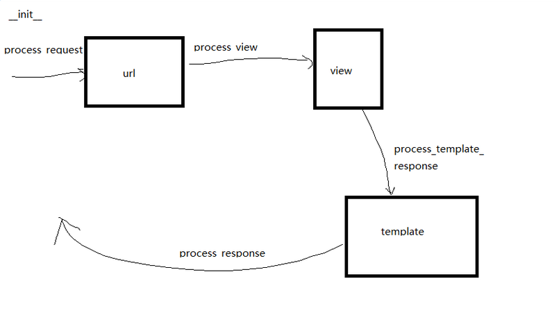

## 另外一种数据校验方法（表单验证）：
>当需要验证的参数很多时，之前的验证方法显得比较笨重；所以可以引入表单验证的方法；

步骤：
1. 创建forms.py文件
2. 导入forms包
3. 创建所需要的表单
4. **注意:表单中的字段应与模板页面中的字段对应；**

用户注册表单：
```
from django.contrib.auth.hashers import make_password, check_password
from django import forms
from django.contrib.auth.models import User


class UserRegisterForm(forms.Form):
    # 定义用户名字段，最大值为20，最小为4，且是必填项
    name = forms.CharField(max_length=20, min_length=4, required=True,
                           error_messages={'required': '用户名不能为空',
                                           'max_length': '不能超过20字符',
                                           'min_length': '不能少于4字符'
                                           })
    # 定义密码字段
    pwd = forms.CharField(max_length=16, required=True,
                          error_messages={'required': '密码不能为空',
                                          'max_length': '不能超过20字符',
                                          'min_length': '不能少于4字符'
                                          })
    # 定义确认密码字段
    pwd2 = forms.CharField(max_length=16, required=True,
                           error_messages={'required': '确认密码不能为空',
                                           'max_length': '不能超过20字符',
                                           'min_length': '不能少于4字符'
                                           })

    def clean(self):
        # 使用form表单的时候自带的一个clean方法
        # 获取用户名，用于校验该用户是否已经注册
        name = self.cleaned_data.get('name')
        # 校验用户是否注册
        user = User.objects.filter(username=name).first()
        if user:
            raise forms.ValidationError({'name': '该用户已经注册了'})
        # 验证密码是否一致
        if self.cleaned_data.get('pwd') != self.cleaned_data.get('pwd2'):
            raise forms.ValidationError({'pwd': '两次密码不一致'})
        return self.cleaned_data
```
## views.py文件中通过Django自带的一些方法和数据库中实现注册功能
```
# 注册
def register(request):
    if request.method == 'GET':
        return render(request, 'register.html')

    if request.method == 'POST':
        # 获取注册页面用户输入的数据
        data = request.POST
        # 将数据提交到form表单中
        form = UserRegisterForm(data)
        # 进行数据校验
        # 验证通过,将数据存入数据库中
        if form.is_valid():
            # create_user是创建普通用户，create_superuser是创建超级用户
            User.objects.create_user(username=form.cleaned_data.get('name'),
                                     password=form.cleaned_data.get('pwd')
                                     )
            return HttpResponseRedirect(reverse('user:login'))
        else:
            # 校验出错
            errors = form.errors
            # 将错误信息返回给页面
            return render(request, 'register.html', {'errors': errors})


```
## 通过Django自带的功能实现登录功能
1. 首先，先创建登录页面对应的forms表单模块：
```
class UserLoginForm(forms.Form):
    # 定义用户名字段，最大值为20，最小为4，且是必填项
    name = forms.CharField(max_length=20, min_length=4, required=True,
                           error_messages={'required': '用户名不能为空',
                                           'max_length': '不能超过20字符',
                                           'min_length': '不能少于4字符'
                                           })
    # 定义密码字段
    pwd = forms.CharField(max_length=16, required=True,
                          error_messages={'required': '密码不能为空',
                                          'max_length': '不能超过20字符',
                                          'min_length': '不能少于4字符'
                                          })

    def clean(self):
        user = User.objects.filter(username=self.cleaned_data.get('name'))
        if not user:
            raise forms.ValidationError({'name': '该用户名没有注册,请去注册！'})

        return self.cleaned_data

```
2.  在views中导入Django自带的方法，实现登录的功能:主要是auth包，login_required包；
```
from django.contrib import auth
from django.contrib.auth.decorators import login_required
from django.contrib.auth.models import User

# 登录
def login(request):
    if request.method == 'GET':
        return render(request, 'login.html')

    if request.method == 'POST':
        data = request.POST
        form = UserLoginForm(data)
        if form.is_valid():
            # 导入auth包，其中有验证用户名和密码的方法authenticate();
            # 去数据库中找匹配该数据的user对象
            user = auth.authenticate(username=form.cleaned_data.get('name'),
                                     password=form.cleaned_data.get('pwd')
                                     )
            if user:
                # 如果找到了，就执行登录操作
                # 使用随机标识符也叫做签名token,使用auth自带的login()方法可以自动添加token
                # 向request.user属性赋值，赋值为登录系统的用户对象；
                # 然后向浏览器页面中的cookie中设置sessionid值，（标识符token令牌）
                # 向服务器数据库中django_session表中设置对应的标识符
                auth.login(request, user)
                return HttpResponseRedirect(reverse('user:index'))
            else:
                return render(request, 'login.html', {'msg': '密码错误'})
        else:
            return render(request, 'login.html', {'errors': form.errors})

```
## 通过auth包中的自带的login_required装饰器来完成首页的加载，与注销功能:
```
# 引入auth自带的login_required装饰器
@login_required
def index(request):
    if request.method == 'GET':
        return render(request, 'index.html')


@login_required
def logout(request):
    if request.method == 'GET':
        # 导入auth中的注销函数，就会将服务器数据库中session表中对应的记录删除；
        auth.logout(request)
        return HttpResponseRedirect(reverse('user:login'))

```
## 中间件（Middleware）就相当于一个拦截器，常用的有process_request、process_view、process_exception、process_template_response、process_response：
它们的流程：



定义和使用中间件的步骤：

1. 一般是在utils工具文件夹中创建；
2. 新建一个名字为middleware的python文件；
3. 导入MiddlewareMiXin包；
```
class TestMiddleware(MiddlewareMixin):

    def process_request(self, request):
        print('process_request')
        # 继续执行对应的视图函数
        return None

    def process_response(self, request, response):
        print('process_response')
        # 响应
        return response
```
4. 在settings.py文件中的MIDDLEWARE中添加中间件的路径：
```
'utils.middleware.TestMiddleware',
```

- process_request最先执行。并且执行的顺序按照settings.py文件中MIDDLEWARE中定义中间件的顺序来执行。
- process_view在视图函数之前执行，并且执行的顺序按照MIDDLEWARE中定义中间件的顺序执行。
- 视图函数在process_view方法后执行，在process_exception方法之前执行。
- process_exception方法，默认是不执行的，在process_response方法之前执行，并且执行的顺序按照MIDDLEWARE中定义的中间件逆序执行。
- process_response方法是最后执行的，并且执行的顺序按照定义中间件的顺序逆序执行。
  最后，多个中间件调用原理，适用于日志的处理；
  **补充：在注册登录的时候，涉及到的密码在数据库中是明文显示的，而我们想要其加密，就需要导包```from django.contrib.auth.hashers importmake_password,check_password# 密码加密解密包```**