## 前后端，前后分离，
后端---返回api接口:格式：json/字典
前端---通过异步加载（ajax），获取后端返回的api接口，并渲染页面

>VUE框架 前端

>Django mvt模式中，做后端，就不用templates了；


>纯粹的后端就是写api接口：
>写接口和接口文档；

>通过Django和 rest framework
>做前后分离

- Http请求方式：
- GET：获取数据
- POST：创建数据
- PUT：修改数据，修改全部的属性的值
- PATCH：修改数据，只修改部分属性的值
- DELETE：删除数据

### REST:
REST是所有Web应用都应该遵守的架构设计指导原则。 

Representational State Transfer，翻译是”表现层状态转化”。 

REST核心: <b><font style="color:red;">资源， 状态转移， 统一接口 </font></b>

<b>资源:</b> 是REST最明显的特征,是指对某类信息实体的抽象，资源是服务器上一个可命名的抽象概念，资源是以名词为核心来组织的，首先关注的是名词。

<b>状态转移:</b> 是指客户端痛服务端进行交互的过程中，客户端能够通过对资源的表述，实现操作资源的目的

<b>统一接口:</b> REST要求，必须通过统一的接口来对资源执行各种操作。对于每个资源只能执行一组有限的操作。 比如，客户端通过HTTP的4个请求方式(POST, GET, PUT, PATCH)来操作资源，也就意味着不管你的url是什么，不管请求的资源是什么但操作的资源接口都是统一的。

GET用来获取资源，POST用来新建资源（也可以用于更新资源），PUT(PATCH)用来更新资源，DELETE用来删除资源。

#### 1. api定义规范

	http://xxx.com/api/


#### 2. 资源

在RESTful架构中，每个网址代表一种资源（resource），所以网址中不能有动词，只能有名词，而且所用的名词往往与数据库的表格名对应。一般来说，数据库中的表都是同种记录的"集合"（collection），所以API中的名词也应该使用复数。

举例来说，有一个API提供动物园（zoo）的信息，还包括各种动物和雇员的信息，则它的路径应该设计成下面这样。


	https://api.example.com/v1/zoos

	https://api.example.com/v1/animals

	https://api.example.com/v1/employees

#### 3. http请求方式

	GET（SELECT）：从服务器取出资源（一项或多项）

	POST（CREATE）：在服务器新建一个资源

	PUT（UPDATE）：在服务器更新资源（客户端提供改变后的完整资源）

	PATCH（UPDATE）：在服务器更新资源（客户端提供改变的属性）

	DELETE（DELETE）：从服务器删除资源


例子：

	GET /zoos：列出所有动物园

	POST /zoos：新建一个动物园

	GET /zoos/ID：获取某个指定动物园的信息

	PUT /zoos/ID：更新某个指定动物园的信息（提供该动物园的全部信息）

	PATCH /zoos/ID：更新某个指定动物园的信息（提供该动物园的部分信息）

	DELETE /zoos/ID：删除某个动物园

	GET /zoos/ID/animals：列出某个指定动物园的所有动物

	DELETE /zoos/ID/animals/ID：删除某个指定动物园的指定动物

#### 4. filter过滤


	?page=2&per_page=100：指定第几页，以及每页的记录数。

	?sortby=name&order=asc：指定返回结果按照哪个属性排序，以及排序顺序。

	?animal_type_id=1：指定筛选条件


#### 5. 状态码

服务端向用户返回请求api的结果，在结果中包含了status codes 状态码的，可以通过状态码去判断请求api的状态是成功还是失败

	200 OK - [GET]：服务器成功返回用户请求的数据，该操作是幂等的（Idempotent）。

	201 CREATED - [POST/PUT/PATCH]：用户新建或修改数据成功。

	202 Accepted - [*]：表示一个请求已经进入后台排队（异步任务）

	204 NO CONTENT - [DELETE]：用户删除数据成功。

	400 INVALID REQUEST - [POST/PUT/PATCH]：用户发出的请求有错误，服务器没有进行新建或修改数据的操作，该操作是幂等的。

	401 Unauthorized - [*]：表示用户没有权限（令牌、用户名、密码错误）。

	403 Forbidden - [*] 表示用户得到授权（与401错误相对），但是访问是被禁止的。

	404 NOT FOUND - [*]：用户发出的请求针对的是不存在的记录，服务器没有进行操作，该操作是幂等的。

	406 Not Acceptable - [GET]：用户请求的格式不可得（比如用户请求JSON格式，但是只有XML格式）。

	410 Gone -[GET]：用户请求的资源被永久删除，且不会再得到的。

	422 Unprocesable entity - [POST/PUT/PATCH] 当创建一个对象时，发生一个验证错误。

	500 INTERNAL SERVER ERROR - [*]：服务器发生错误，用户将无法判断发出的请求是否成功。


#### 6. 错误处理

如果状态码是4xx，就应该向用户返回出错信息。一般来说，返回的信息中将error作为键名，出错信息作为键值即可。
​	
	{
		error: '错误信息'
	}


#### 7. django中使用restful

	pip install djangorestframework==3.4.6


	pip install django-filter  # Filtering support


#### 8. settings.py配置的修改

在工程目录中的settings.py文件的INSTALLED_APPS中需要添加rest_framework

	INSTALLED_APPS = [
		...
	
	    'rest_framework',
	]

#### 9. 在应用app中定义路由URL

定义路由需要注意：

1. 使用router.register注册的url为资源，而且资源只能为名词不能为动词。
2. 定义的资源不要加'/'斜杠，在访问地址的时候，URL中会默认的添加反斜杠'/'
```
   from django.conf.urls import url
   	
   	from rest_framework.routers import SimpleRouter

   	from app import views

   	# 引入路由
   	router = SimpleRouter()
   	# 使用router注册的地址
   	router.register(r'^student', views.StudentView)
   	
   	urlpatterns = [
   	
   	]
   	urlpatterns += router.urls
```

#### 10. 在视图views.py文件中定义StudentView类


通过定义StudentView并继承了mixins的方法，即可有对应个增删改查的方法。在StudentView中还定义了两个变量queryset、serializer_class。

	from rest_framework import viewsets, mixins

	from app.models import Student
	from app.serializers import StudentSerializer


	class StudentView(mixins.ListModelMixin,
	                  mixins.CreateModelMixin,
	                  mixins.DestroyModelMixin,
	                  mixins.RetrieveModelMixin,
	                  mixins.UpdateModelMixin,
	                  viewsets.GenericViewSet):
	
	    # 返回数据
	    queryset = Student.objects.all()
	    # 序列化结果
	    serializer_class = StudentSerializer

其中queryset参数表示需要需要序列化的数据
serializer_class参数指定序列化的类

#### 11. 定义序列化类

序列化类需要继承ModelSerializer，使用ModelSerializer表明序列化整个Student模型，并且可以指定虚拟化哪些字段。

	from rest_framework import serializers

	from app.models import Student

​	
	class StudentSerializer(serializers.ModelSerializer):

	    class Meta:
	        # 指定序列化的模型
	        model = Student
	        # 指定序列化哪些字段
	        fields = ['id', 's_name', 's_age']


通过以上的代码，可以通过以下的URL和HTTP请求方式，完成对资源Student的CRUD操作：

CRUD对应的增删改查：
​	
	增： POST http://127.0.0.1:8080/stu/addStu/

	删： DELETE http://127.0.0.1:8080/stu/addStu/1/

	改： UPDATE http://127.0.0.1:8080/stu/addStu/1/

	查： GET http://127.0.0.1:8080/stu/addStu/1/


## rest使用2

#### 1. 修改响应的结构

##### 1.1 修改settings.py中的返回数据结构的配置信息

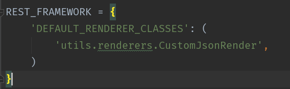

注意：定义default_renderer_classes参数，指定render的时候使用我们自定义的CustomJsonRender的类方法

##### 1.2 重构JSONRenderer下的render方法

该方法继承了JSONRenderer并且重构了render方法，修改了返回的数据结构

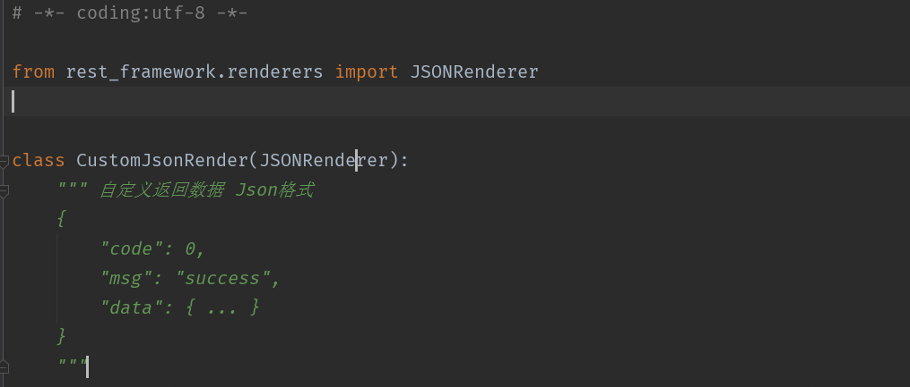


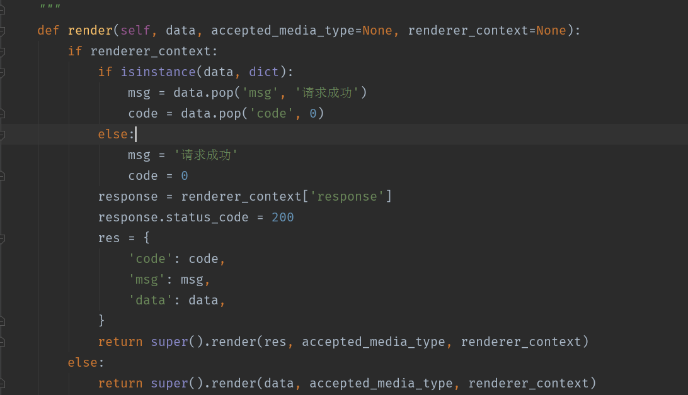
​	

#### 2. 异常的响应的结构


自定义异常处理，一定需要继承from rest_framework.exceptions import APIException
中的APIException，在编写自己的异常处理的方法

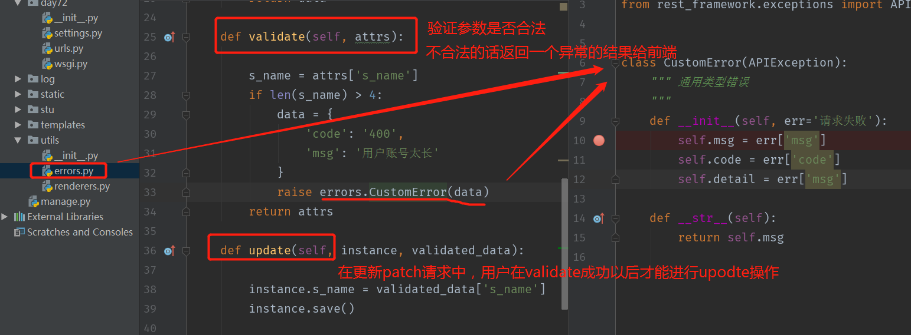

#### 3. PATCH请求，传入空置处理

##### 3.1 空置处理

该patch请求中，我们想要修改id为3的学生的姓名，但是姓名我们传递一个空置，查看返回结果如下:

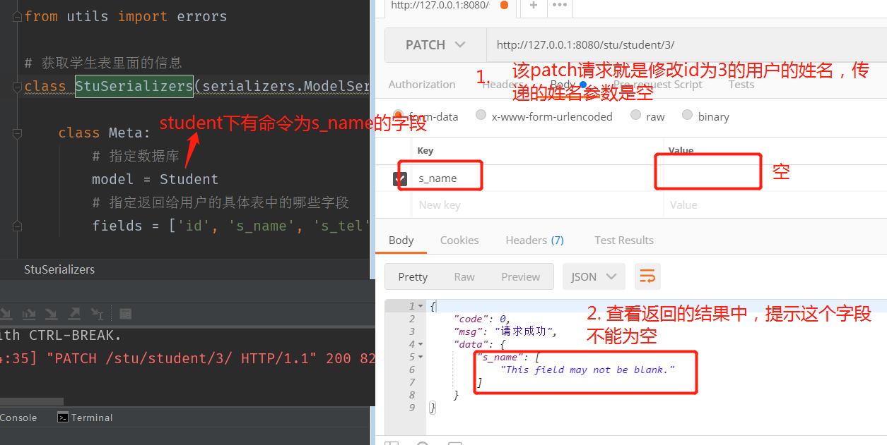

##### 3.2 修改

在serializer中定义s_name的序列化，指定错误的信息，为空的话，提示响应的错误信息

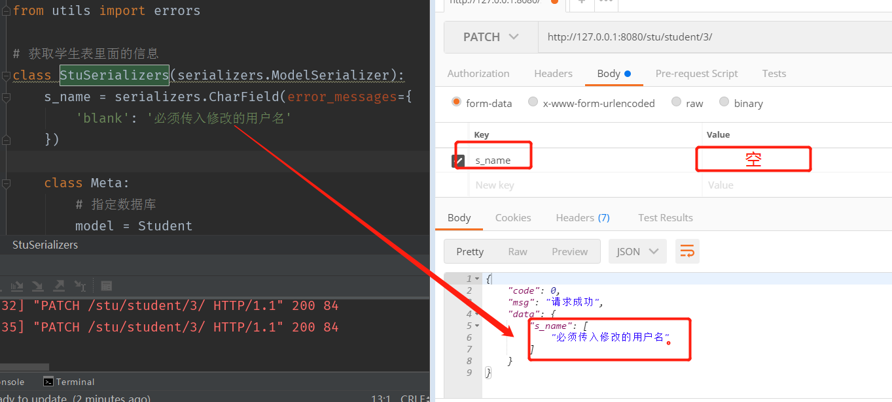

***

#### 4. 页面异步提交api接口请求，并且在前端通过js刷新页面

##### 4.1. 创建实例

###### 4.1.1 后端业务逻辑处理 

创建url，定义register，创建serializer_class等

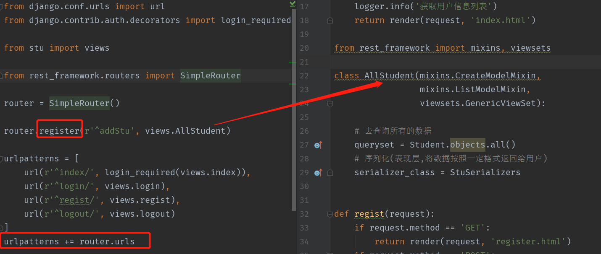


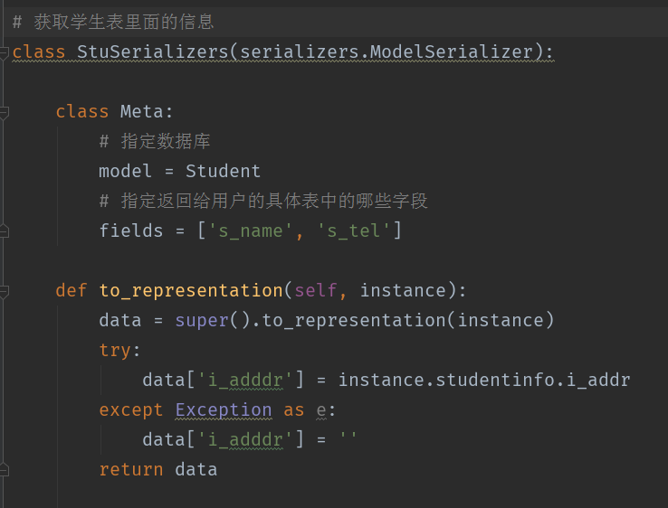

##### 4.2 前端ajax请求get获取数据并刷新

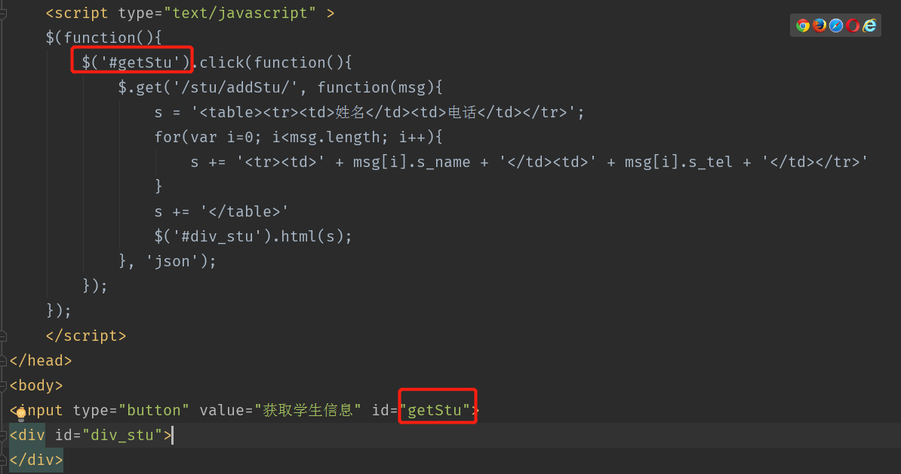


##### 4.3 前端ajax请求delete删除数据

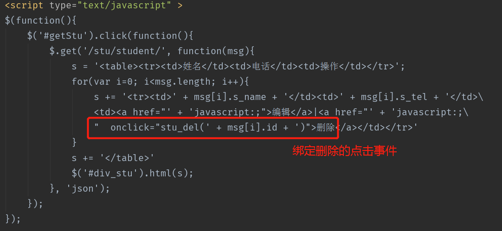

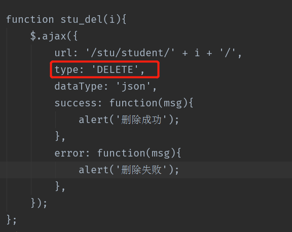

##### 4.4 直接放入ajax更新删除获取信息的代码

	<!DOCTYPE html>
	<html lang="en">
	<head>
	<meta charset="UTF-8">
	<title>展示所有学生的信息</title>
	<script type="text/javascript" src="/static/js/jquery.min.js"></script>
	<script type="text/javascript">
	    $(function(){
	        $('#showStus').click(function(){
	            $.get('/stu/student/', function(msg){
	                s = '<table><tr><td>ID</td><td>姓名</td><td>地址</td><td>操作</td></tr>'
	                for(var i=0; i<msg.length; i++){
	                    s += '<tr><td>' + msg[i].id + '</td>\
	                    <td>' + msg[i].s_name + '</td>\
	                    <td>' + msg[i].s_tel + '</td><td>\
	                    <a href="javascript:;" onclick="stu_update(' + msg[i].id + ')">编辑</a>|\
	                    <a href="javascript:;" onclick="del_stu(' + msg[i].id + ')">删除</a></td></tr>'
	                }
	                s += '</table>'
	                $('#div_stus').html(s)
	            }, 'json');
	        });
	    });
	
	    function del_stu(i){
	        csrf = $('input[name="csrfmiddlewaretoken"]').val()
	        $.ajax({
	            url:'/stu/student/' + i,
	            type:'DELETE',
	            headers:{'X-CSRFToken': csrf},
	            dataType:'json',
	            success: function(msg){
	                alert('删除成功');
	            },
	            error: function(msg){
	                console.log(msg)
	            },
	        });
	    };
	
	    function stu_update(i){
	        s = 'ID: <input type="hidden" name="id" value="' + i + '">\
	        姓名:<input type="text" name="s_name" id="s_name"> \
	        电话：<input type="text" name="s_tel" id="s_tel">\
	        <input type="button" value="提交" onclick="update(' + i + ')">'
	
	        $('#div_add').html(s)
	    };
	
	    function stu_add(){
	        s = '姓名:<input type="text" name="s_name" id="s_name"> \
	        电话：<input type="text" name="s_tel" id="s_tel">\
	        <input type="button" value="提交" onclick="add()">'
	
	        $('#div_add').html(s)
	    };
	
	function update(i){
	    csrf = $('input[name="csrfmiddlewaretoken"]').val()
	    s_name = $('#s_name').val()
	    s_tel = $('#s_tel').val()
	    $.ajax({
	        url: '/stu/student/' + i + '/',
	        type: 'PATCH',
	        dataType: 'json',
	        headers:{'X-CSRFToken': csrf},
	        data:{'s_name':s_name, 's_tel':s_tel},
	        success: function(msg){
	            console.log(msg)
	        },
	        error: function(msg){
	            console.log(msg)
	        },
	    });
	}
	
	function add(){
	    csrf = $('input[name="csrfmiddlewaretoken"]').val()
	    s_name = $('#s_name').val()
	    s_tel = $('#s_tel').val()
	    $.ajax({
	        url: '/stu/student/',
	        type: 'POST',
	        dataType: 'json',
	        headers:{'X-CSRFToken': csrf},
	        data:{'s_name':s_name, 's_tel':s_tel},
	        success: function(msg){
	            console.log(msg)
	        },
	        error: function(msg){
	            console.log(msg)
	        },
	    });
	}
	</script>
	
	</head>
	<body>
	
	<input id="showStus" value="获取所有学生的信息" type="button"></input>
	<div id="div_stus">
	
	</div>
	<div id="div_add"></div>
	<a href="javascript:;" onclick="stu_add()">添加</a>
	</body>
	</html>

#### 5. 跨域请求

##### 5.1 什么是跨域

同源：是指相同的协议、域名、端口，三者都相同才属于同源。

同源策略：浏览器处于安全考虑，在全局层面禁止了页面加载或执行与自身来源不同的域的任何脚本，站外其他来源的脚本同页面的交互则被严格限制。

跨域由于浏览器同源策略，凡是发送请求url的协议、域名、端口三者之间任意一与当前页面地址不同即为跨域

#### 6. rest中的坑

在实际的django项目中，我们经常需要使用到用户表，但是基于django提供的User表的字段有限，开发者一般都不会使用django提供的User模型，而自己创建User模型，并且基于登录注册的功能，也都会自己去实现，而不会使用django提供的登录注册功能。

重点坑:在我们使用自定义的User模型进行用户的登录以及注册的时候，我们使用自定义的中间件进行对用户进行验证，如果验证通过了，就将当前登录的用户User对象绑定在request中，即request.user = user。这个时候坑就出现了，当我们使用restframework去写api接口的时候，会出现权限认证错误，如下提示：

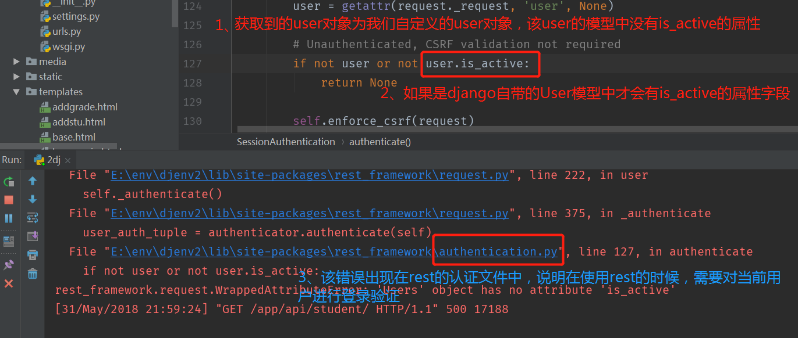

经过分析，可以判断是rest需要进行身份验证，所有我们在settings.py中设置rest的api接口不需要进行authentication的验证，具体配置如下：

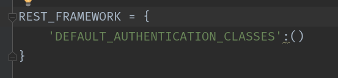


